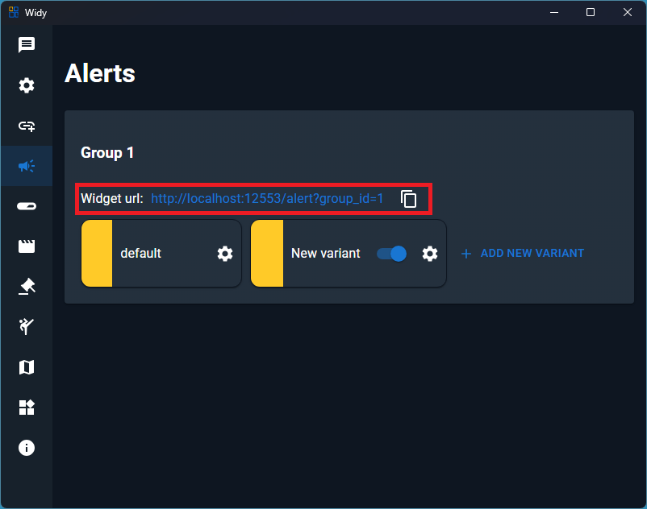
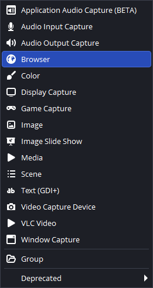
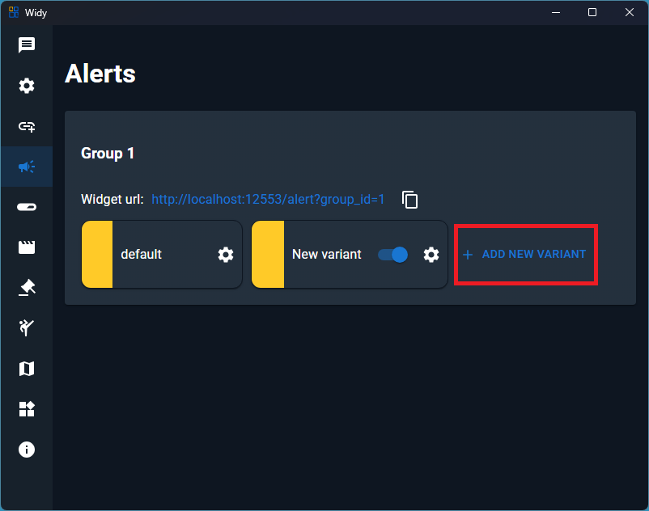
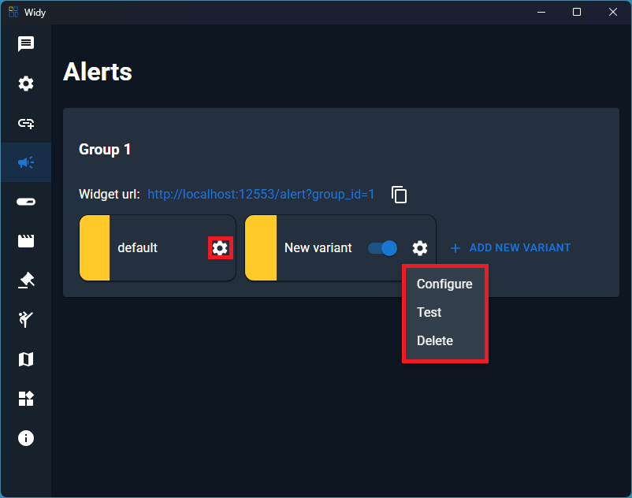

# Alerts

## Adding Alerts Group to OBS

You can display your alerts group in OBS (Open Broadcaster Software) using a browser source. Follow these steps:

### Step 1: Get the Alerts Widget URL

First, obtain your alerts widget URL:

Copy the URL from your alerts group settings.

### Step 2: Add as Browser Source in OBS

In OBS, add a new Browser Source and paste the alerts widget URL:

1. Create a new Browser Source
2. Paste your alerts widget URL
3. Adjust the width and height as needed for your stream layout
4. Your alerts will now appear in real-time on your stream

## Step 3: Creating New Alert Variants

Press the **Add New Variant** button to create a new alert:

You can create multiple alert variants to customize how different types of alerts appear on your stream.

## Step 4: Configure, Test, or Delete Alerts

Click the **gear icon** to manage your alerts:

From the alert settings, you can:

- **Configure** - Customize the alert appearance and behavior
- **Test** - Send a test alert to preview how it will look
- **Delete** - Remove the alert variant

