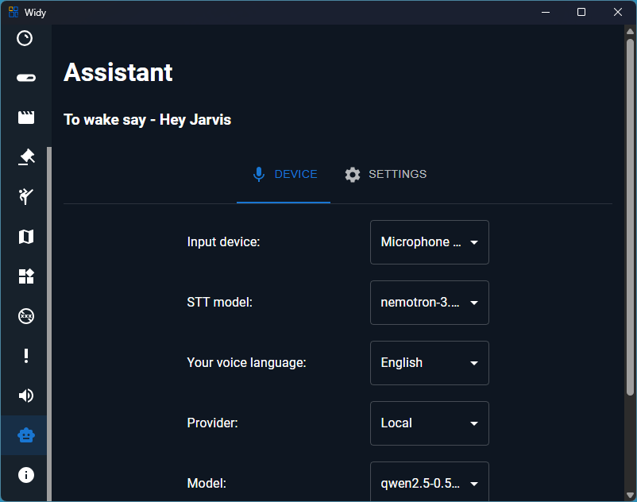
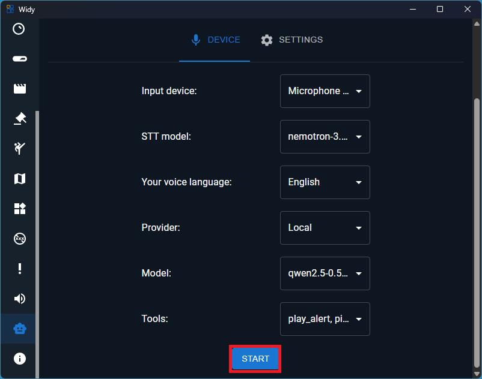

# Assistant

Say "Hey Jarvis" to activate it, then speak your request. This page explains every setting on the Assistant screen and how to start and stop the assistant.

## Input Device

Choose the microphone you want Hey Jarvis to listen on. If you have multiple microphones connected (for example, a headset and a built-in laptop mic), select the one you want the assistant to use for wake-word detection and for capturing your requests.

## STT Model

This selects the speech-to-text engine used to turn your spoken words into text once the assistant has heard "Hey Jarvis". Different models offer different trade-offs between transcription accuracy and speed.

## STT Language

Set the language you'll be speaking to the assistant in. Choosing the correct language improves how accurately your speech is transcribed. If the assistant is having trouble understanding you, double-check that this matches the language you're actually speaking.

## Provider

Pick which AI service powers the assistant's "thinking" — how it understands your request and decides what to do. Available options include cloud providers as well as a local, on-device option.

:::info Connecting a provider
Cloud providers must be connected in your account's **Services** settings before they can be used here. If you select a provider that isn't connected yet, you'll see a notice when you try to start the assistant, and it won't start until the provider is connected.
:::

## Model

Once you've chosen a provider, select which model from that provider the assistant should use. The list of available models updates automatically based on the provider you picked.

## Tools

Choose which capabilities you want to give the assistant permission to use when responding to you — for example, controlling smart devices or looking things up. Only the tools you turn on here are available to the assistant; anything not selected, it won't be able to do.

When you talk to the assistant, each enabled tool expects arguments in plain language. For example, you can say things like:

- "Play alert named Welcome"
- "Pin message 'Thanks for the follow!' on Twitch"
- "Ban user Nightbot on Twitch for 10 minutes"
- "Unban user Nightbot on Kick"
- "Change channel title on YouTube to 'Now streaming: news and updates'"
- "Play media 'Never Gonna Give You Up'"

The assistant understands the tool name and the values you provide, such as the platform, username, duration, message, or title. Use the exact tool arguments shown in the tool list, but in a natural sentence.

Before a tool can perform actions on a platform, that platform must be connected in your account's **Services** settings. For **Kick**, you also need **KickSession** connected and active.

## Wake Threshold

Controls how confident the assistant needs to be that it actually heard "Hey Jarvis" before it wakes up and starts listening.

- **Lower this** if the assistant isn't waking up when you say the wake word.
- **Raise this** if the assistant wakes up by accident from background noise or unrelated speech.

## VAD Threshold

Controls how sensitive the assistant is to detecting that you're actively speaking (versus silence or background noise) once it's awake.

- **Lower this** if the assistant is cutting off the beginning or end of what you're saying.
- **Raise this** if the assistant is picking up background noise as if it were speech.

## Max Tokens

Sets a limit on how long the assistant's spoken/written responses can be. A higher value allows longer, more detailed answers; a lower value keeps responses short and quick.

## Silence Hangover Frames

Controls how long the assistant waits after you stop talking before it decides you're finished and starts processing your request.

- **Lower this** for a snappier assistant that responds as soon as you pause — but it may cut you off if you pause mid-sentence.
- **Raise this** if the assistant keeps interrupting you before you're done speaking.

:::note
All of the settings above can only be changed while the assistant is **stopped**. Stop the assistant first if a setting appears greyed out.
:::

## Starting and Stopping the Assistant

Use the button at the bottom of the screen to turn the assistant on or off:

- **Start** — saves your current settings and starts the assistant. If the AI provider you selected isn't connected yet, you'll see a warning and the assistant won't start until you connect it.
- **Stop** — shuts the assistant down so you can change settings again.
- While the assistant is turning on or off, the button will show **Starting**, **Stopping**, or **Downloading** (if a model needs to be downloaded first), and settings remain locked until the process finishes.

If something goes wrong while starting or stopping, an error message will appear explaining what happened.