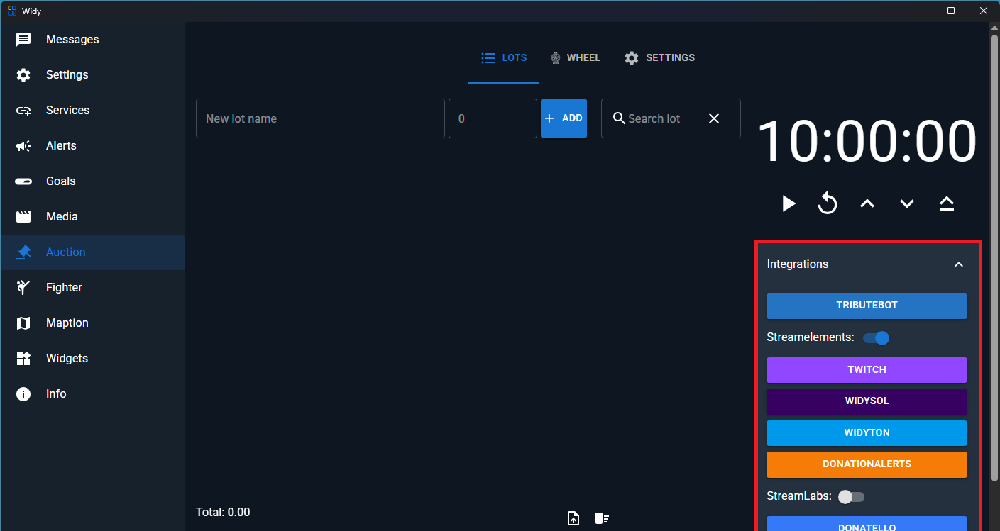
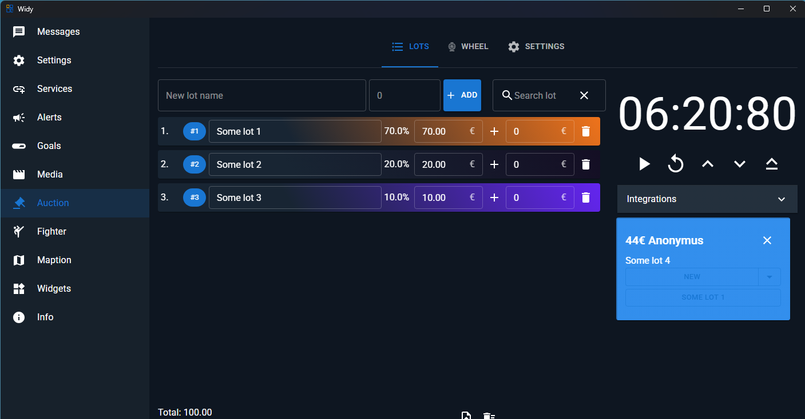

# Lots

## Integrations - Show New Donations

When you connect integrations to your auction, new donations can be automatically captured and displayed. The integrations feature allows you to manage incoming donations and organize them into lots.

### Managing Donations from Integrations

Once donations come through your integrations, you have two options:

- **Move to Existing Lot**: Add the donation to an already created lot in your auction
- **Create New Lot**: Create a new lot specifically for this donation

This provides flexibility in organizing your auction items based on donation sources and categories.

## Manual Lot Addition

You can also add lots manually to your auction without relying on integrations. This is useful when you want to:

- Directly manage your auction lots
- Add items before integrations are set up
- Include items from sources not connected through integrations

### Steps to Add Lots Manually

1. Navigate to the Lots section
2. Fill in the lot details (name, amount)
3. Click the "Add" button

This approach gives you complete control over your auction structure and organization.