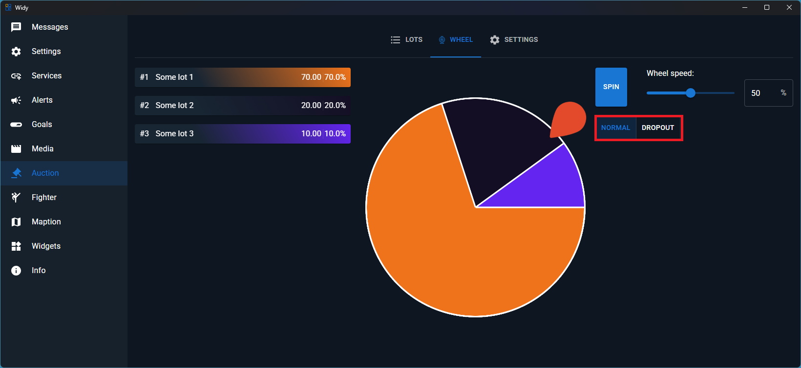

# Wheel

The Wheel feature is an exciting way to randomly select winners from your auction lots. You can configure different wheel types to customize how winners are determined.

## Wheel Types

You can choose between different wheel types to control winner selection behavior:

### Normal Wheel

In Normal mode, only one spin is needed to randomly determine the winner. The selection is weighted by lot amount - the larger the lot amount, the greater the chance of winning. This ensures that lots with higher values have proportionally higher odds of being selected.

### Dropout Wheel

In Dropout mode, each spin eliminates lots from the wheel until only one lot remains. Multiple spins are required, with each spin removing participants from the competition. This creates a progressive elimination process where lots are gradually removed until a single winner emerges.

## Spinning the Wheel

### Normal Wheel Process

To randomly select a winner using Normal mode:

1. Choose Normal wheel type
2. Click the Spin button once
3. The wheel rotates and randomly selects a winner based on weighted odds
4. The selected lot is highlighted as the winner
5. The process completes with a single winner determined

### Dropout Wheel Process

To randomly select a winner using Dropout mode:

1. Choose Dropout wheel type
2. Click the Spin button - this eliminates some lots from the wheel
3. Continue spinning multiple times, with each spin removing more lots
4. Repeat until only one lot remains on the wheel
5. The final remaining lot is declared the winner

### Best Practices

- **Normal Wheel**: Use when you want a quick, single-spin winner selection where higher-value lots have better odds. Ideal for time-sensitive events or when you want to reward larger contributions proportionally.
- **Dropout Wheel**: Use when you want a more interactive, multi-round elimination process. This builds suspense and engagement as participants are gradually eliminated until one winner remains.

The randomization ensures fairness and adds an element of excitement to your auction event!

