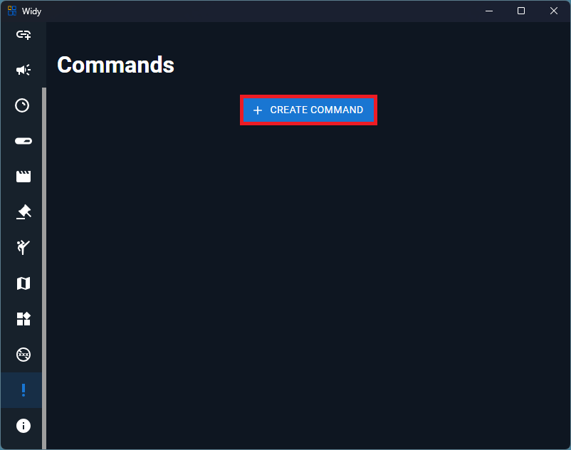
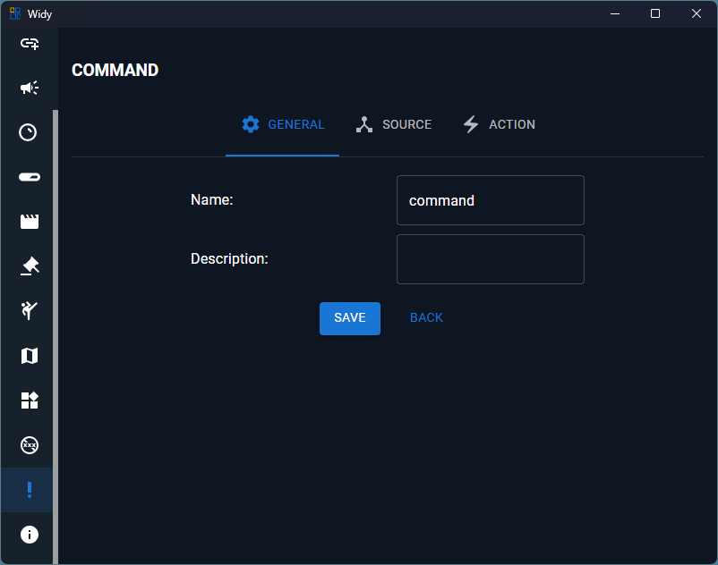
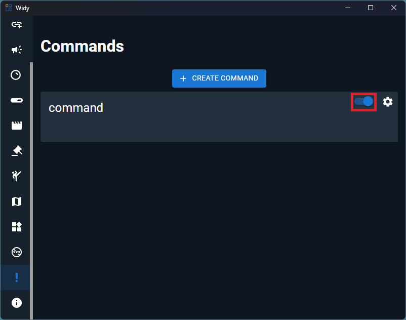
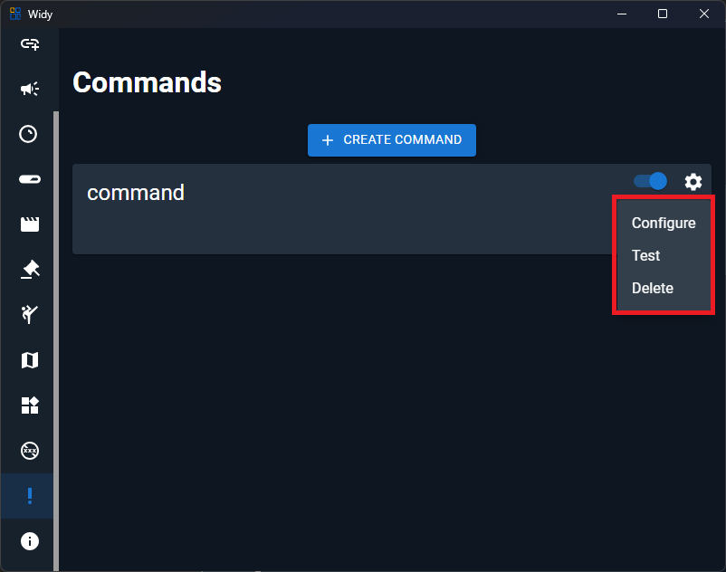

# Commands

Commands let you run actions from different sources. For example, a response from a chat bot can be triggered based on a user's message or on a timer.

## Create a Command

To create a new command, click the **Create Command** button.

## Command Settings

After creating a command, open the command settings to choose the source and the actions that should run.

You can choose:

- the command source, such as chat or timer
- the action or actions to execute when the command is triggered

## Enable or Disable a Command

Once a command is created, you can quickly turn it on or off.

## Managing Commands

Use the command management options to configure, test, or delete a command.

From the command menu you can:

- **Configure** - edit the command settings
- **Test** - run a test to verify the behavior
- **Delete** - remove the command

