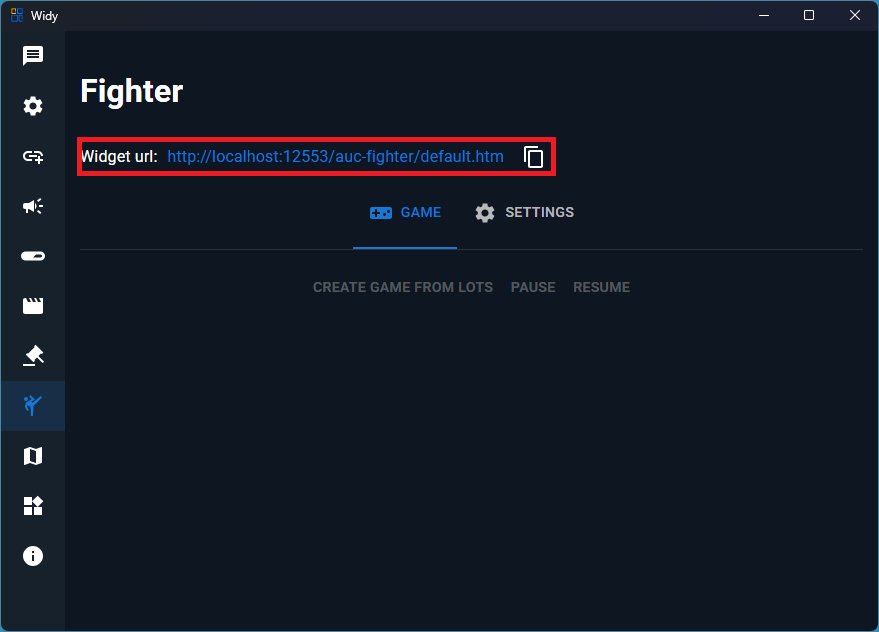
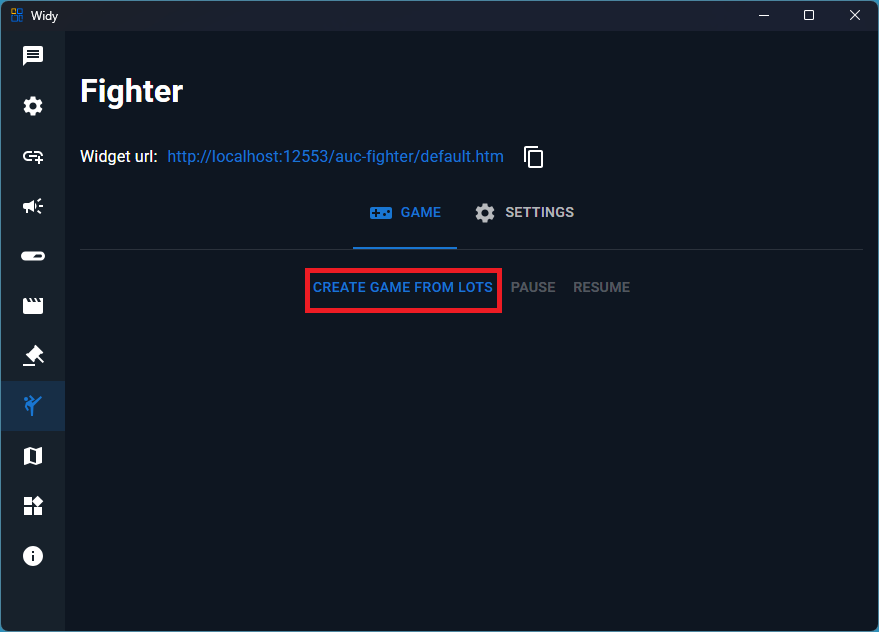
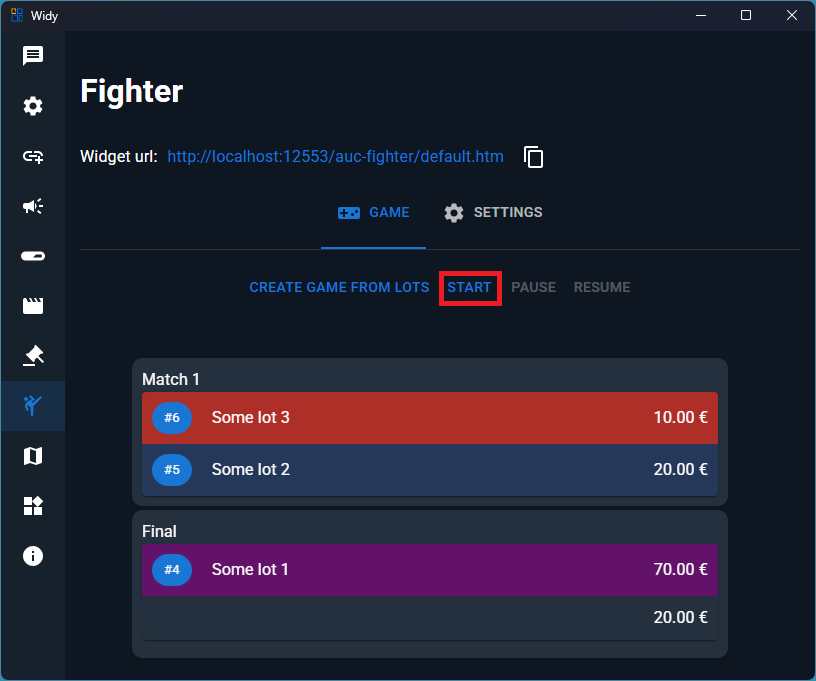
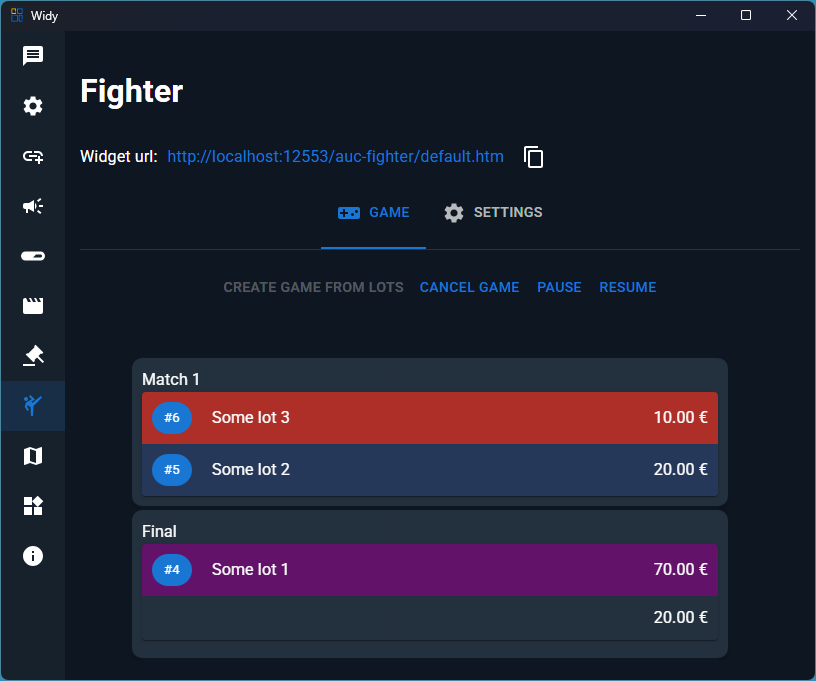
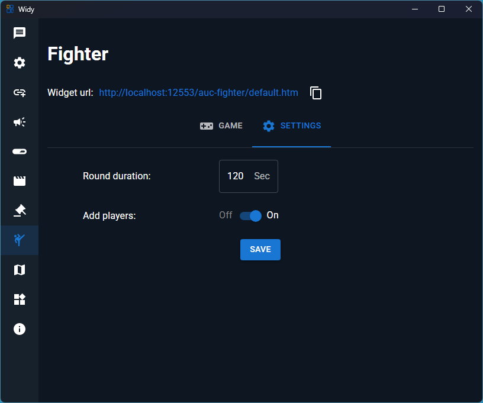

# Fighter

Fighter is an exciting game where auction lots fight each other in a tournament-style competition. Lots compete in 2 rounds, with the probability of winning determined by the lot with the larger sum during each round. You can increase a lot's probability of winning by making donations.

## How It Works

In the Fighter game:

1. **Round Structure**: The game consists of 2 rounds where lots compete against each other.
2. **Winning Probability**: The lot with the larger sum has a higher probability of winning each round.
3. **Donation Boost**: Donations can increase a lot's probability, giving supporters a way to influence the outcome.
4. **Tournament Format**: Lots are eliminated round by round until a champion is determined.

## Setting Up the Widget

To display the Fighter game in OBS:

1. Get the Fighter Widget URL from your dashboard.

2. Add the URL to an OBS Browser Source.

## Creating a Game

When you have 2 or more lots in your auction, you can create a Fighter game:

Select the lots you want to include in the tournament and create the game.

## Starting the Game

Once you've created a game, you can start it:

The game will begin with the first round of competitions.

## Controlling the Game

During the game, you have full control:

You can:
- **Pause**: Temporarily stop the current round
- **Resume**: Continue from where you paused
- **Cancel**: End the game early if needed

## Settings

Configure the Fighter game settings:

Key settings include:
- **Game Round Duration**: Set how long each round lasts
- **Add Player on Donation**: Enable/disable automatic player addition when new donations arrive  (x2 lot amount)

