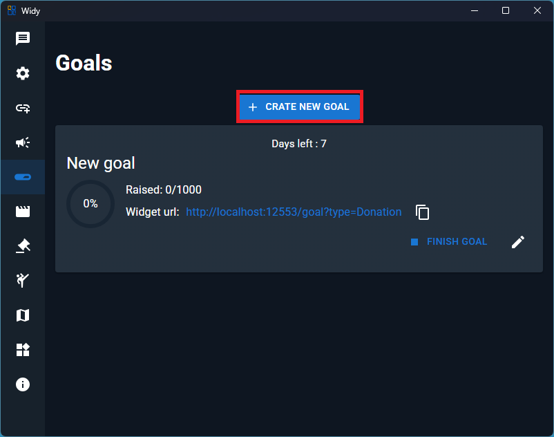
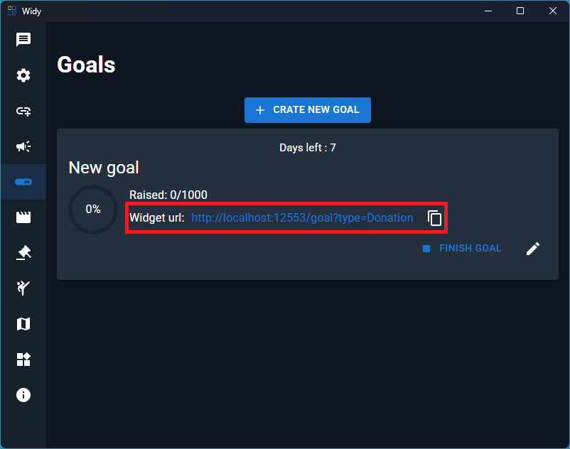
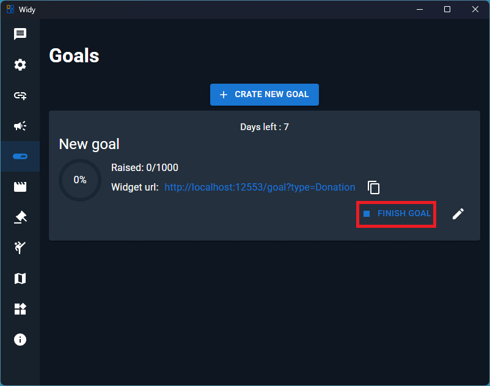
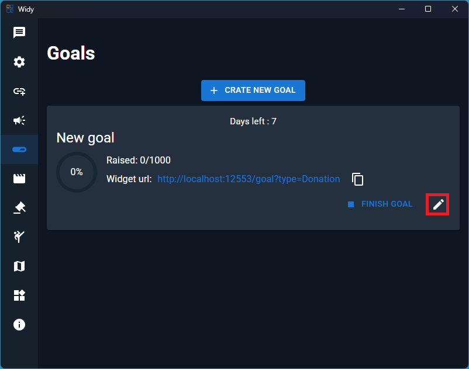

# Goals

Create and display fundraiser-style goals for donations, follows, subscriptions, and other milestone events.

## Step 1: Create a New Goal

Press the **Create New Goal** button to start a goal for donations, follows, subscriptions, or another supported goal type.

Choose your goal type and configure the target amount or count.

## Step 2: Get the Goal Widget URL

Copy the widget URL so you can display the goal in OBS.

## Step 3: Add the Goal to OBS

In OBS, add a Browser Source and paste the goal widget URL.

1. Create a new Browser Source
2. Paste the goal widget URL
3. Adjust width and height as needed
4. Your goal will now appear on your stream

## Step 4: Finish and Edit the Goal

After configuring your goal, press the finish button to save it.

To update the goal settings later, click the edit icon.

