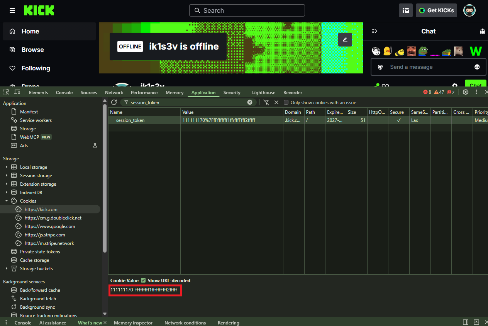

# Kick session token

This token is required so the assistant can authenticate to Kick on your behalf and access the account features it needs to work.

### How to get a session token

1. Log in to [kick.com](https://kick.com) in your browser
2. Open Developer Tools → Application → Cookies
3. Copy the value of `session_token` (or the `authorization` header from a network request)

