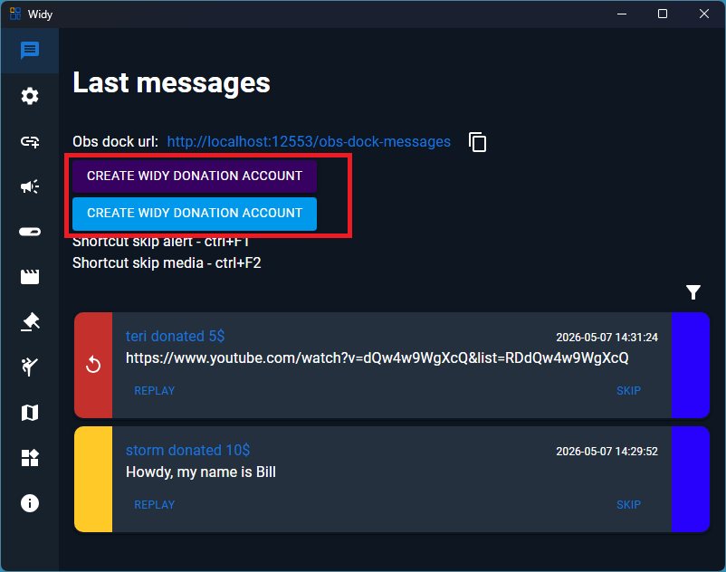
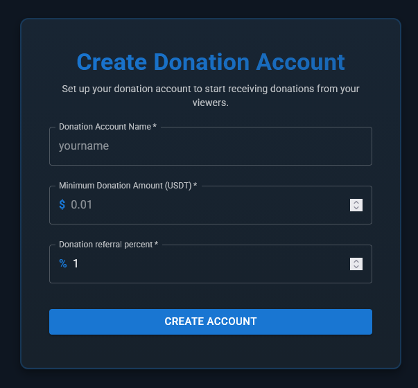

# Create donation account

To create a Widy donation account, you can choose between TON and Solana networks. Click on the appropriate button to proceed to the creation form.

## Creation Form

After selecting your preferred network, you'll be directed to the donation account creation form.

### Form Fields

- **Donation Account Name**: Enter a unique name for your donation account. This will be used in the URL for donations.
- **Minimum Donation Amount**: Set the minimum donation amount in USDT. Donors must donate at least this amount.
- **Donation Referral Percent**: Choose a percentage (1-50%) that referrers will receive from donations they attract. Higher percentages may encourage more referrals.

## Using Your Donation Account

Once created, your donation account can be accessed via a URL in the format: `https://widy.fun/d/donation-account-name`

This allows others to easily find and donate to your account using the unique name you specified.