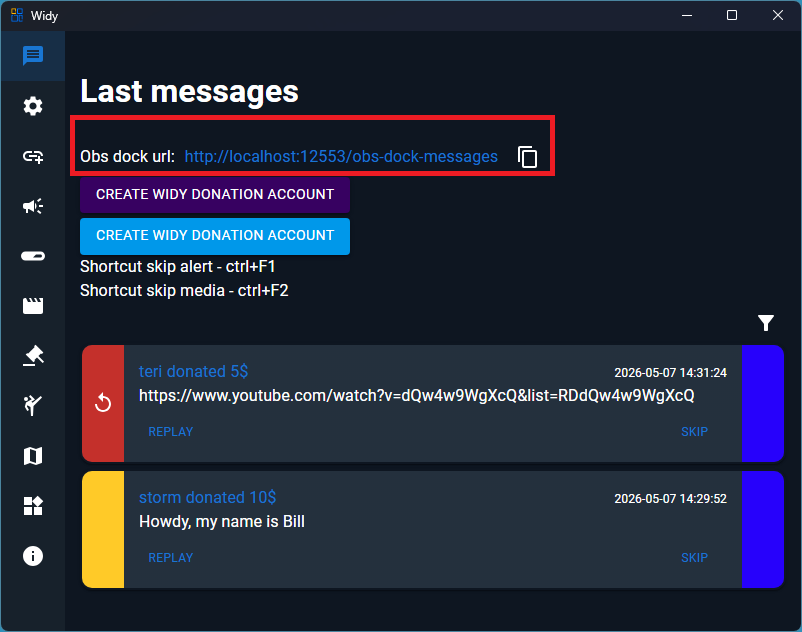
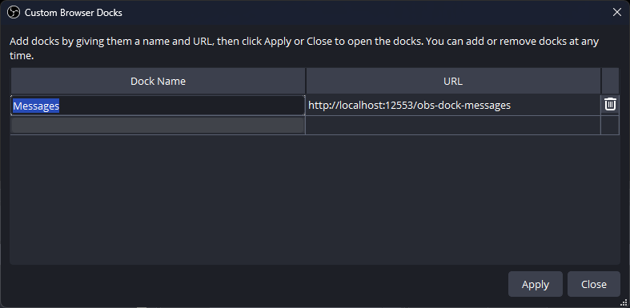
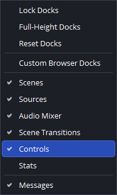
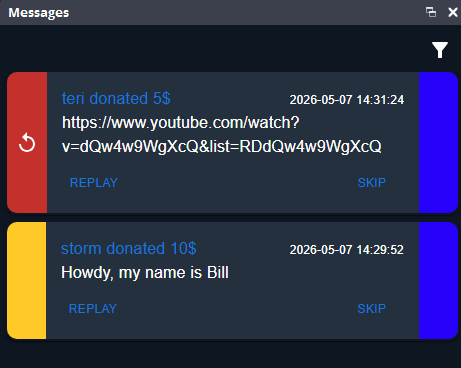

# OBS dock URL

Use a custom browser dock in OBS to show the last messages panel from Widy.

## 1. Copy the browser dock URL

Open the Widy last messages URL and copy the link shown in the browser address bar. This is the URL you will paste into OBS.

## 2. Open OBS custom browser docks

In OBS, open the menu and go to `View` → `Docks` → `Custom Browser Docks...`.

In the Custom Browser Docks dialog:

- Enter a name like `Messages`.
- Paste the copied URL into the URL field.
- Click `Apply` or `OK`.

## 3. On it in menu

