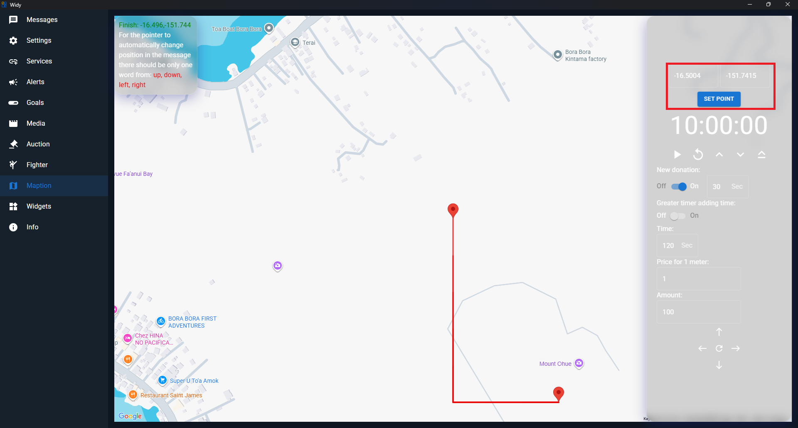
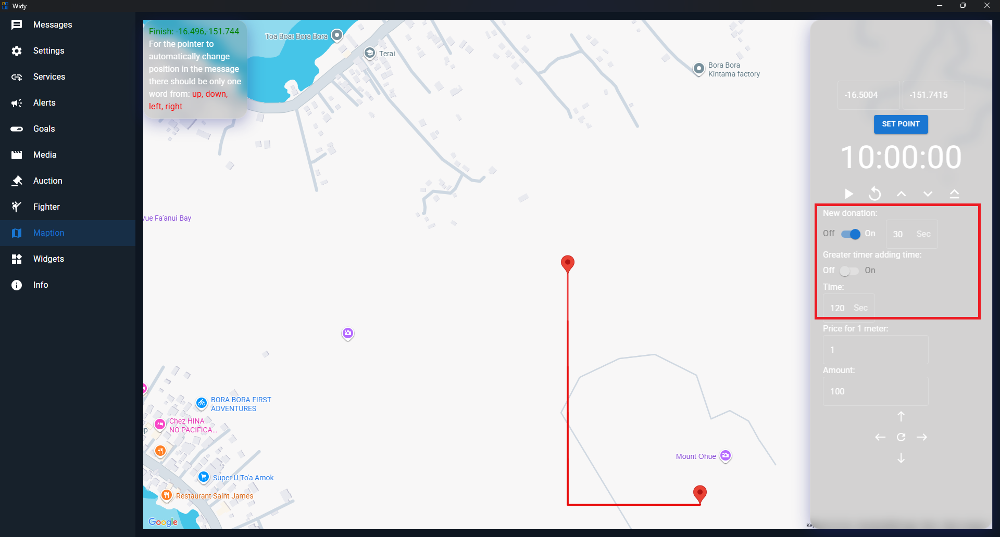
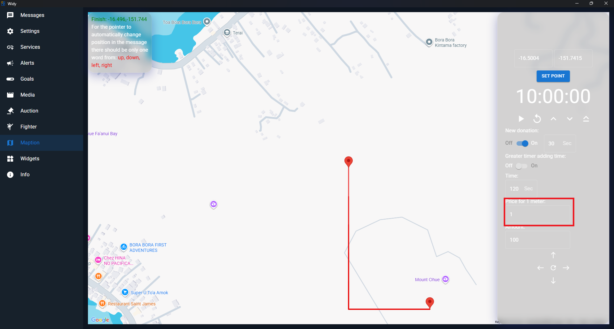

# Maption

Maption is a special auction format where the final result is not a winning lot, but the finished coordinates on the map.

## How it works

At the start, set the initial location using latitude and longitude fields and click **Set Point**. The countdown begins from that starting point.

## Settings

Use the Maption settings to define how donations move the point:

- **Time between donations** — how long it takes before the next donation is added.
- **Price per meter** — the amount required for the marker to move by one meter.

## Donation movement

To move the marker automatically with incoming donations, the donation message must contain exactly one word: `up`, `down`, `left`, or `right`.

When a valid direction word is received, the marker moves in that direction according to the configured meter price.

## Manual control

You can also move the marker manually with the arrow controls and specify the amount to move.

