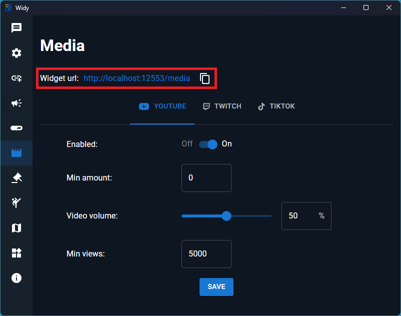
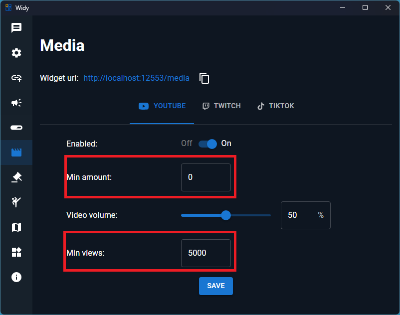

# Media

## Displaying Media Clips in OBS

You can display YouTube videos, TikTok clips, and Twitch clips in OBS (Open Broadcaster Software) using a browser source. Follow these steps:

### Step 1: Get the Media Widget URL

First, obtain your media widget URL from your media settings:

Copy the URL from your media settings.

### Step 2: Add as Browser Source in OBS

In OBS, add a new Browser Source and paste the media widget URL:

1. Create a new Browser Source
2. Paste your media widget URL
3. Adjust the width and height as needed for your stream layout
4. Your media clips (YouTube videos, TikTok, and Twitch clips) will now appear in real-time on your stream

## Supported Media Types

The media widget supports:
- YouTube videos
- TikTok clips
- Twitch clips

Make sure your media sources are properly configured in the media settings to display correctly in OBS.
## Media Playback Conditions

You can set conditions for when media clips should play based on donations and views:

### Minimum Donation Amount

Set a minimum donation amount to trigger media playback:

- **Min Amount**: Media will only play if the donation amount is equal to or greater than this value
- **Min Views**: Media will only play if the video has equal to or greater than this number of views

These settings help you control when media clips are displayed based on the generosity of donations and popularity of content.
:::note
For media, you will also need to add the alerts widget URL to a separate browser source in OBS. See the [Alerts guide](./alerts.mdx) for detailed instructions.
:::

