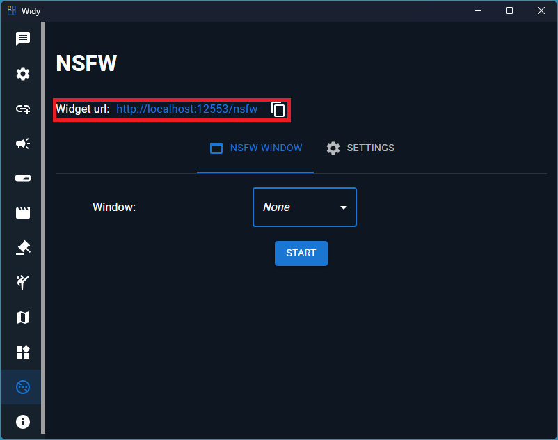
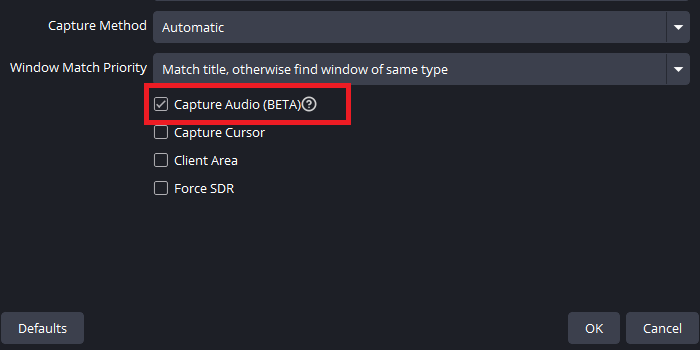
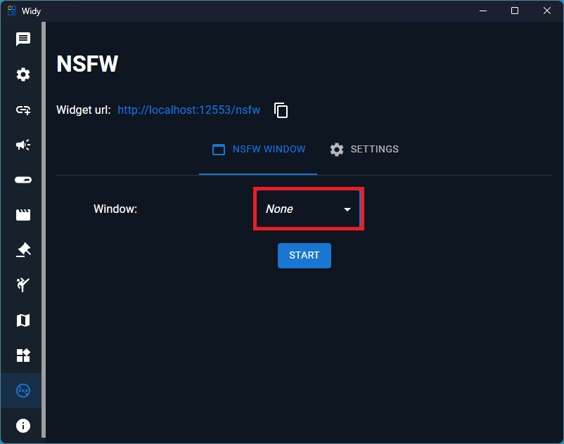
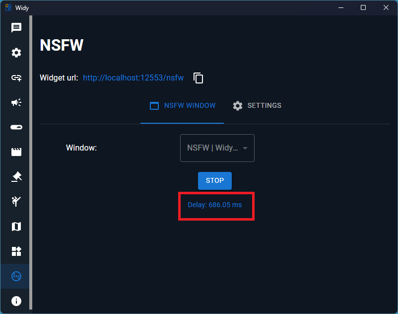
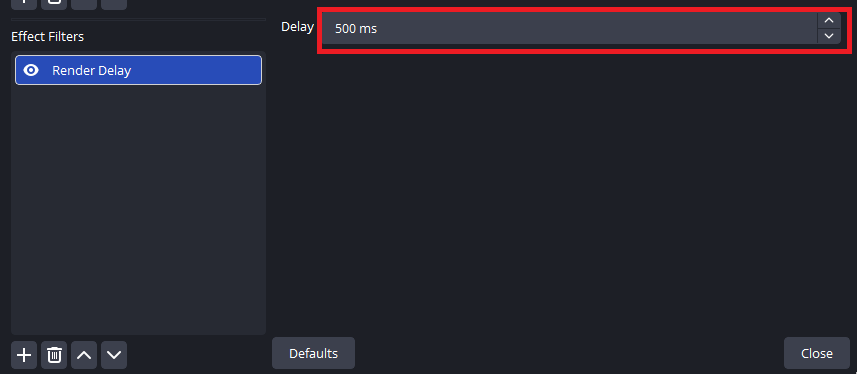
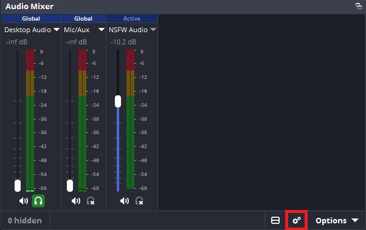
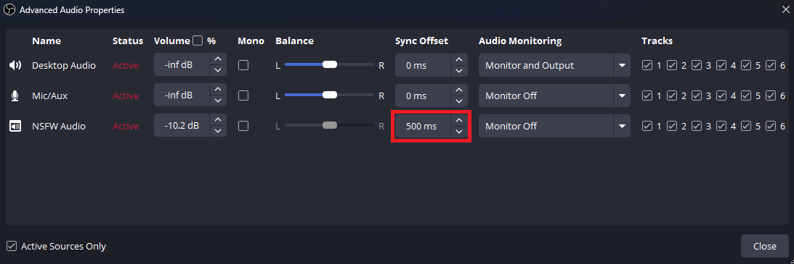
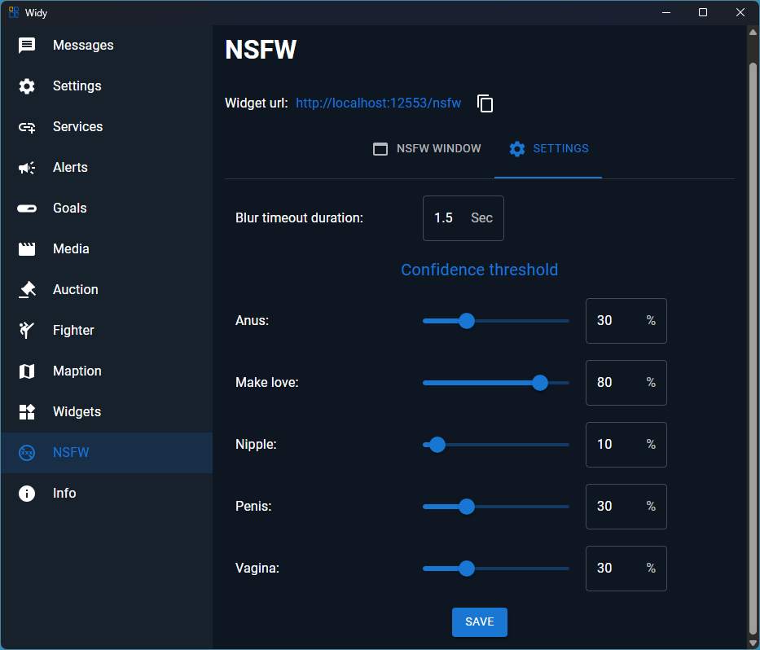

# NSFW

This page explains how to set up the NSFW filter to hide sensitive content in a selected window using AI and OBS. 

## Setup steps

1. Add the NSFW widget as a Browser Source

	- In OBS, click `+` in Sources → choose `Browser` and name it (for example "NSFW Blur").
	- For the URL use the Widget url and click OK.
    - The size must be full screen.
	- Move this Browser Source to the top of the source list for the scene so it can overlay the window when needed.

	

2. Add the target application window (Window Capture)

	- Click `+` in Sources → choose `Window Capture` and select the application/window you want to monitor.
	- If you need the application's audio as well, select Capture Audio.

    

3. Measure the average processing/display delay

	- Select the window (press Start). The UI looks like the image below.

	

	- The measured delay will be shown like the image below. Note the value (in ms), round it, and use it for the next step.

	

4. Add a delay filter to the Window Capture (video)

	- Right-click the Window Capture source → `Filters` → under `Effect Filters` click `+` and add a Render delay filter (name it e.g. "NSFW Video Delay").
	- Enter the rounded delay value from step 3 into the filter settings. See the example below.

	

	- If the required delay is greater than ~500 ms, you can add an additional delay filter and split the offset between two filters to reach the needed total delay.

5. Add audio delay (if using application audio)

	- Open `Advanced Audio Properties` for the audio source and set the `Sync Offset` to the same rounded delay (ms) measured earlier.

	
	

6. Configure NSFW plugin/widget settings

	- Open the NSFW settings and set the `blur duration` and `confidence threshold` for each class to suit your needs.

	

Tips

- Keep the NSFW widget Browser Source on top so it can overlay blur masks or censoring layers as needed.
- Test with safe and flagged content to verify timing: start the latency tester, adjust delays, and run a few test captures.
- If the plugin provides per-class thresholds, tune them gradually to avoid false positives.

