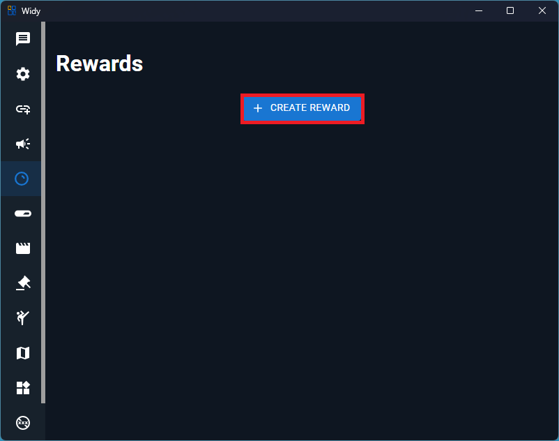
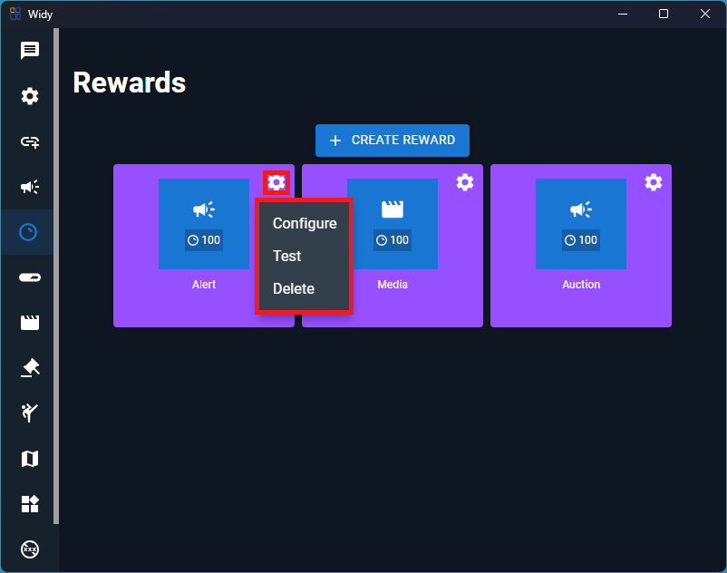

# Rewards

Channel points rewards allow your viewers to redeem points for custom actions. You can create various types of rewards including alerts, media, and auction lots.

## Creating a Reward

To create a new reward for your channel points:

1. Navigate to the Rewards
2. Click the **Create** button
3. Configure your reward settings as shown below:

### Reward Types

When creating a reward, you can choose from the following types:

- **Alerts** - Display a custom alert message to your stream
- **Media** - Play a youtube video, twitch clips or tiktok
- **Auction Lots** - Add items to your auction for viewers to bid on with channel points

## Managing Rewards

After creating a reward, you have several options to manage it:

From the reward settings, you can:

- **Configure** - Customize the reward appearance and behavior
- **Test** - Send a test alert to preview how it will look
- **Delete** - Remove the reward variant

