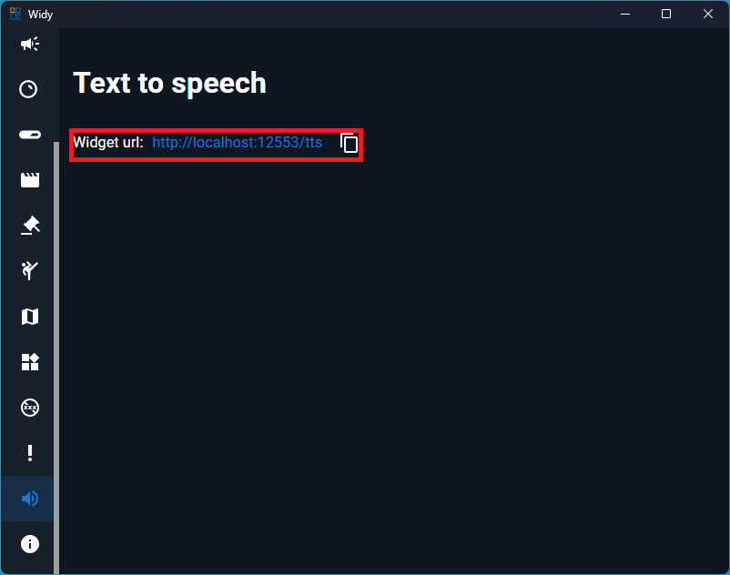

# TTS

TTS can be used in points rewards and commands. To use it, you need to add the widget URL in OBS.

## Step 1: Get the TTS Widget URL

Copy the widget URL so you can display the TTS widget in OBS.

## Step 2: Add the TTS Widget to OBS

In OBS, add a Browser Source and paste the TTS widget URL.

1. Create a new Browser Source
2. Paste the TTS widget URL
3. Adjust width and height as needed
4. Your TTS widget will now appear on your stream

