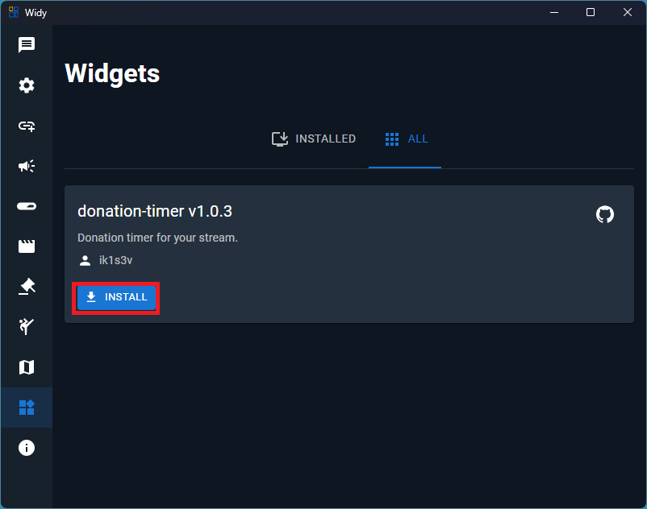
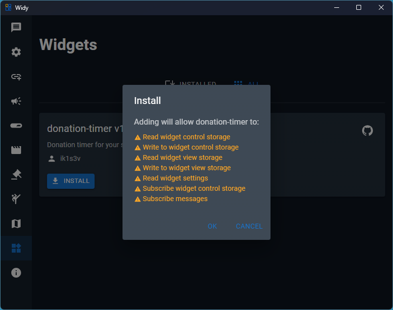
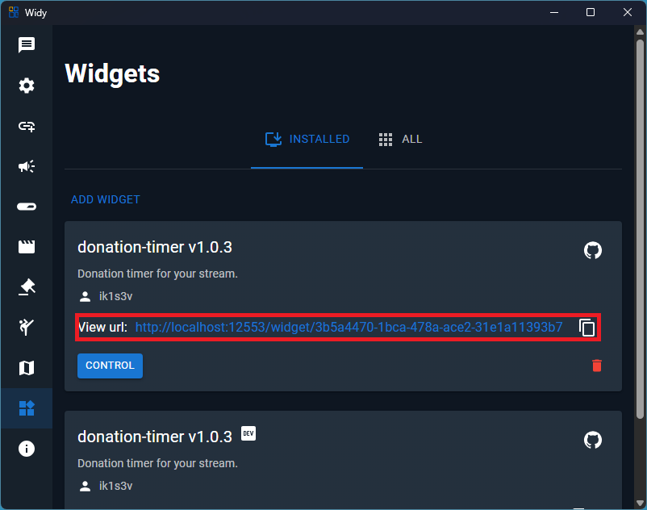
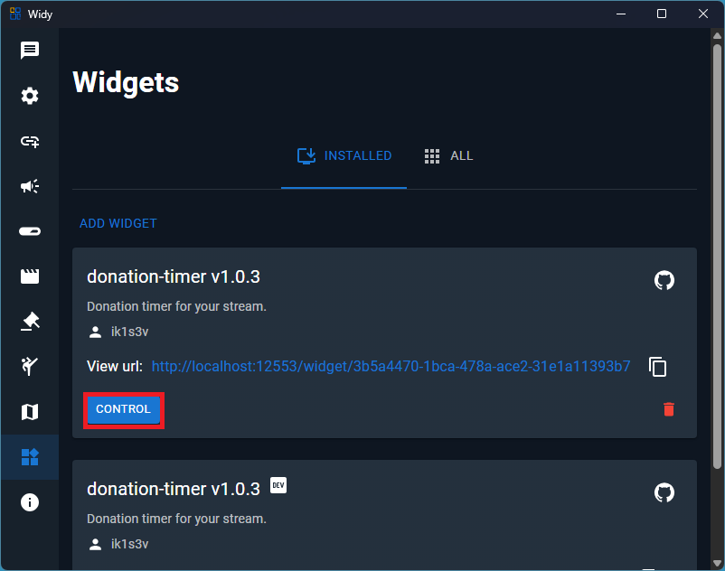
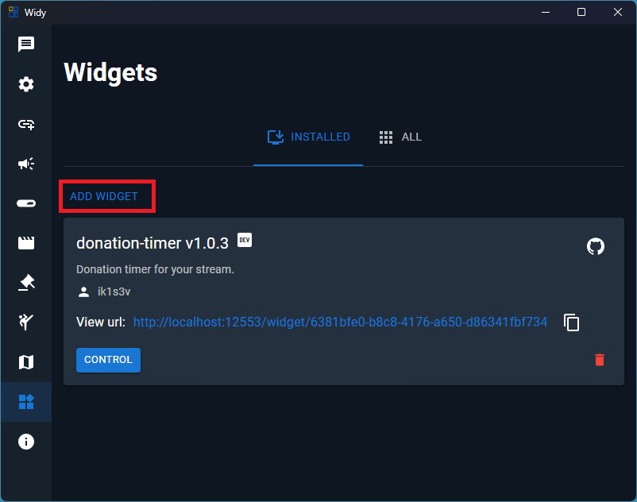

# Widgets

You can install widgets developed by the community that will expand your streaming capabilities.

## Installing and Managing Widgets

In the **All** section, you can install or update existing widgets.

## Widget Scopes and Permissions

The widget can access features such as messages, goals, and more if the user grants access during installation.

## Viewing Widgets

After installation, you can add the widget to the OBS browser source.

## Customizing Widgets

The widget can also be customized by pressing the control button.

## Adding Widgets as a Developer

Developers can also add the widget directly, for example, by using [create-widy-widget](https://github.com/widy-fun/create-widy-widget). When you click the Add Widget button, select the dist folder, and the widget will be added.

